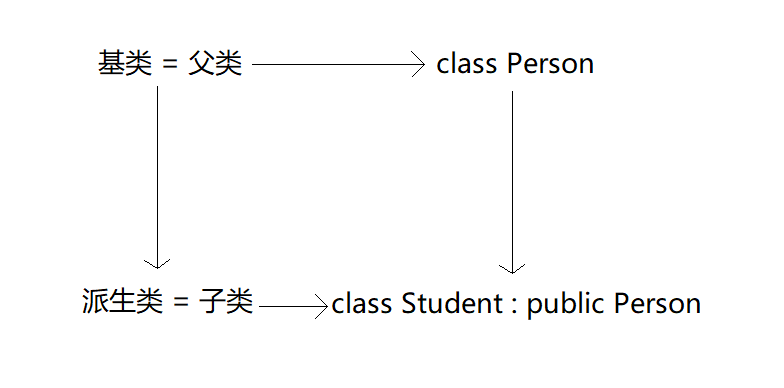
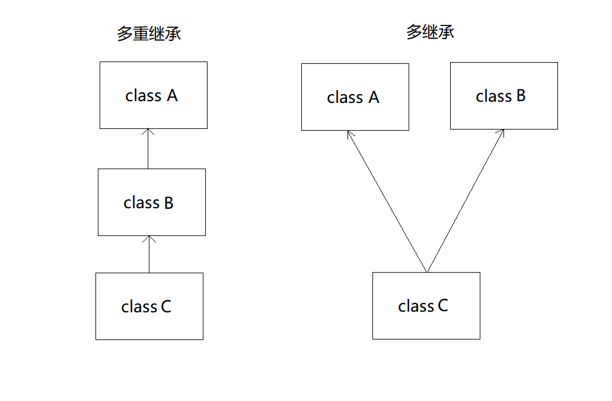
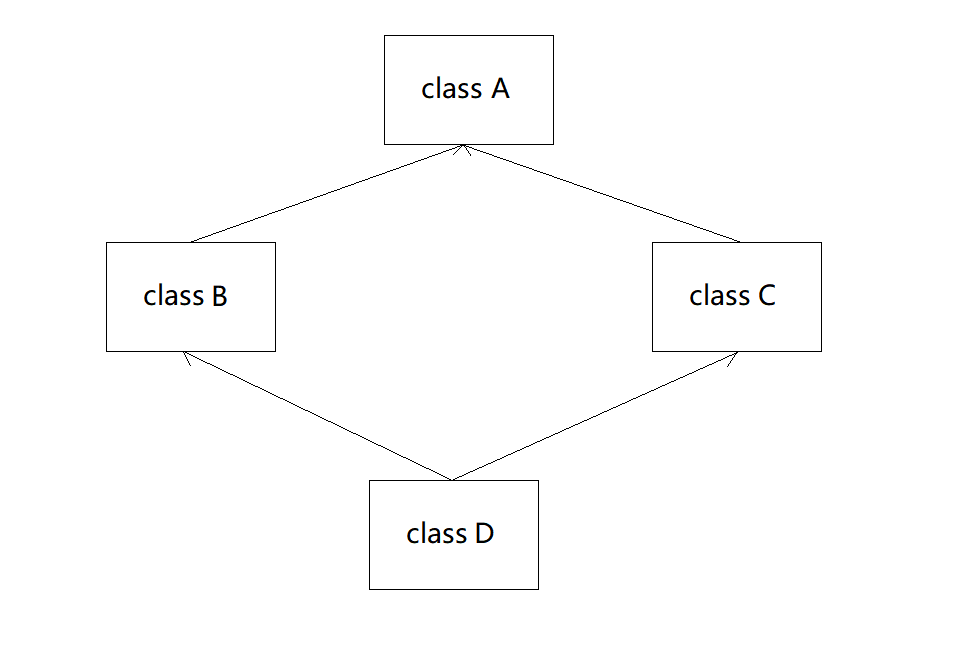
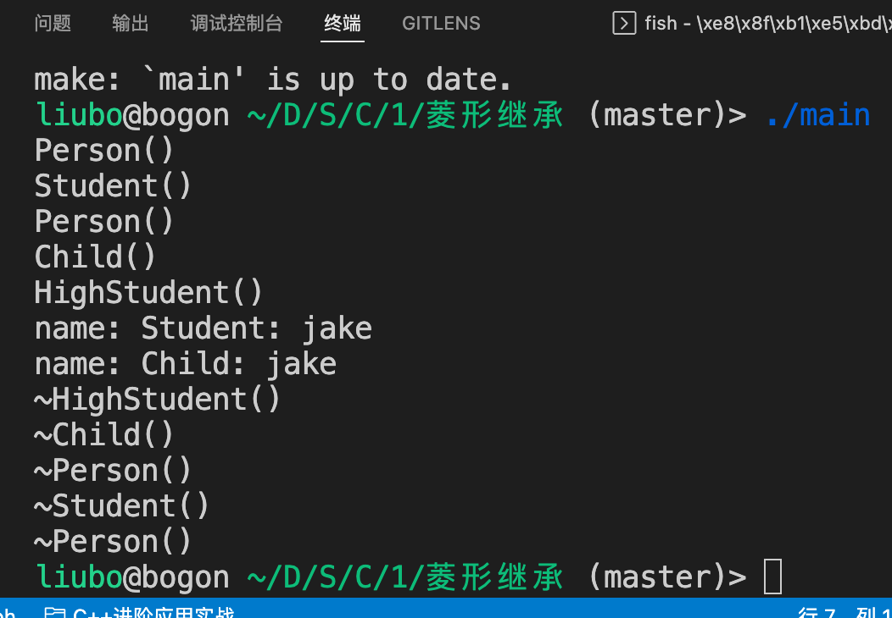
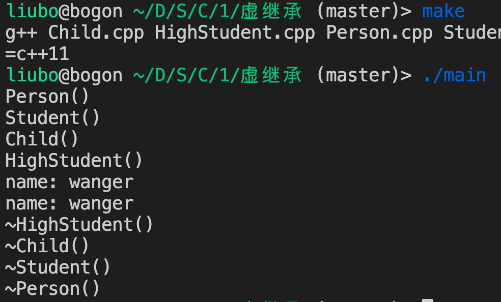
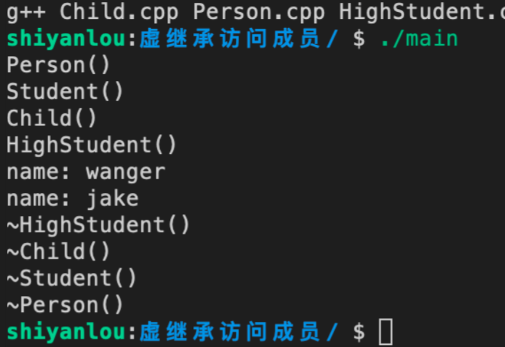
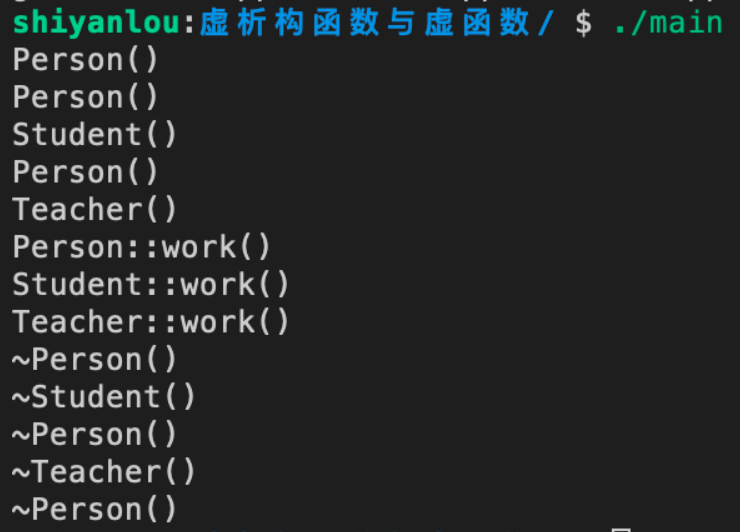
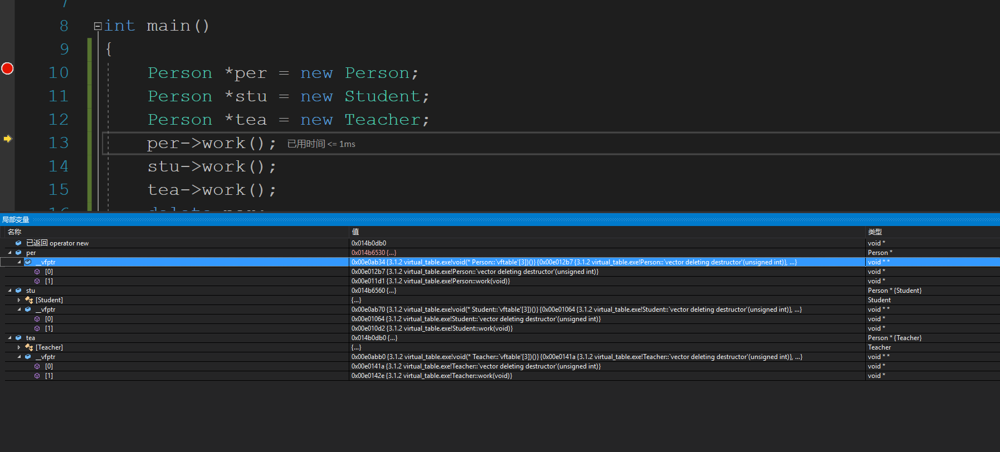
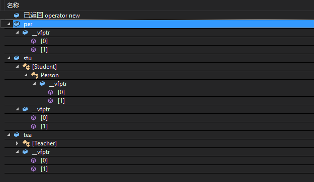

# C++ 相关概念

| 概念         | 描述                                                         |
| ------------ | ------------------------------------------------------------ |
| 构造函数     | 类的构造函数是一种特殊的函数，在创建一个新的对象时自动调用   |
| 析构函数     | 类的析构函数也是一种特殊的函数，在删除所创建的对象时自动调用 |
| 拷贝构造函数 | 拷贝构造函数，是一种特殊的构造函数，它在创建对象时，是使用同一类中之前创建的对象来初始化新创建的对象 |
| 友元函数     | 友元函数可以访问类的 private 和 protected 成员               |
| 内联函数     | 通过内联函数，编译器试图在调用函数的地方扩展函数体中的代码   |
| 类成员函数   | 类的成员函数是指那些把定义和原型写在类定义内部的函数，就像类定义中的其他变量一样 |
| 类访问修饰符 | 类成员可以被定义为 public、private 或 protected。默认情况下是定义为 private |
| this 指针    | 每个对象都有一个特殊的指针 this，它指向对象本身              |
| 静态成员     | 类的数据成员和成员函数都可以被声明为静态的                   |

# 01——初识类与对象

- ## 自定义类（01_类与对象/Student.cpp）

类定义注意事项：

1. 定义一个类时，需要使用关键字 class 来进行修饰。
2. 一个简单的类可以没有构造函数和析构函数，但是系统自动生成一个默认的构造函数和析构函数。
3. 在类中使用关键字 public 、 private 和 protected 来限制数据成员和成员函数，一般使用 public 和 private 来修饰数据成员和成员函数。
4. 一般将数据成员封装在 private 关键字下，不让用户直接访问数据成员，而是通过成员函数来进行访问。
5. 在类的最后（大括号后）必须要有一个分号，勿忘。

- ## 实例化对象（01_类与对象/main01.cpp）

**实例化对象有两种方式，一种是在栈上实例化，另一种是在堆上实例化。**

实例化对象注意事项：

1. 在栈上实例化的对象，超出定义域对象资源会自动被系统回收。
2. 在堆上实例化的对象，最后需要使用 delete 关键字来释放内存，否则会造成内存泄漏。
3. 使用栈实例化的对象使用 “.” 来访问数据成员或成员函数，在堆上实例化的对象使用 “->” 来访问数据成员或成员函数。
4. 释放完内存后将对象置空，防止野指针。

- ## String

#### string 初始化方式

| 实例化                          | 解释                            |
| ------------------------------- | ------------------------------- |
| string s1;                      | s1 为空字符串                   |
| string s2("ABC");               | s2 初始值为 "ABC"               |
| string s3 = s2;  string s3(s2); | s3 初始化为 s2 的一个副本       |
| string s4(n, 'c' );             | s4 初始化为字符 'c' 的 n 个副本 |

#### string 常用操作

> 以下列出了 string 经常使用的操作，如果还需要用到其他操作可以在 [官网](https://en.cppreference.com/w/) 查找 string 类的相关使用方法，里面配有示例程序。

| 操作      | 解释                                                  |
| --------- | ----------------------------------------------------- |
| s.empty() | 判断 s 是否为空，如果 s 为空返回 true，否则返回 false |
| s.size()  | 返回 s 中字符的个数，和 s.length() 功能相同           |
| s[n]      | 返回 s 中位置 n 的字符，位置从 0 开始。切记不要越界   |
| s1 + s2   | 将 s1 和 s2 连接成新字符串，返回新字符串              |
| s1 = s2   | 赋值，将 s2 内容赋值给 s1                             |
| s1 == s2  | 判断相等，相等返回 true，否则返回 false               |
| s1 != s2  | 判断不等，不等返回 true，否则返回 false               |
| s.c_str() | 返回 char*，和 s.data() 功能相同                      |
| stoi()    | 字符串转 int，还有 stol()，stoll()                    |
| stof()    | 字符串转 float, 还有 stod()，stold()                  |

- ## 类外定义（01_类与对象/main.cpp、Student.cpp、Student.h）

类外定义有两种方式：

1. 同文件类外定义。
2. 分文件类外定义。

同文件类外定义就是将类的成员函数定义在类之外的地方，同时类的成员函数使用类作用域来进行定义。在实际项目开发中，类不是很复杂时可以使用该方法，类比较复杂时不推荐使用。

分文件定义类就是将类的定义放在 `xxx.h` 头文件中，而类的成员函数实现放在 `xxx.cpp` 文件中。这种做法是做项目时推荐使用的方法，因为这样将类的定义和成员函数分开后，在开发时很容易能够查找到对应的定义和成员函数。

一般情况下文件名和类名相同，便于开发时类管理。

# 02——类的封装

> C++ 使用关键字 class 来进行封装，使用 public、protected、private 关键字表示封装的状态。

#### 关键字

- class：对类进行封装。
- public：共有成员，用户能够直接访问类中 public 属性的数据成员和成员函数。
- protected：保护成员，用户不能直接访问数据成员和成员函数，继承该类后可以访问。
- private：私有成员，用户不能直接访问数据成员和成员函数。

#### 代码解释（02_类与封装/Student.cpp、Point.cpp、Cat.cpp）

- 示例代码 1 中，学生类 private 以下区域的数据成员 name 和 age 都属于私有数据成员，public 下的成员函数都是属于公有属性。
- 默认情况下，类的成员都是私有属性，例如示例代码 2 中 Point 类的数据成员 x 和 y 都是属于私有属性。
- struct 和 class 是类似的功能，但是 struct 默认情况下成员都是公有属性，如示例代码 3，struct 一般用于定义数据结构。
- 数据成员与成员函数绑定，不能直接对私有数据成员进行访问，如果需要访问数据成员则需要访问对应绑定的公有成员函数。

# 03——对象的生离死别

- ## 内存分区

#### 介绍

> 根据存储数据的类型，系统将不同类型的数据存储在不同的区域，作为 C++ 开发者，必须对内存的分区以及使用了然于心。

#### 分区

一般情况下，根据内存用途将内存划分为五个区：

| 内存区 | 用途解释                   |
| ------ | -------------------------- |
| 栈区   | 存储函数的参数、局部变量等 |
| 堆区   | 由程序员分配、释放内存     |
| 全局区 | 存储全局变量和静态变量     |
| 常量区 | 存储常量                   |
| 代码区 | 存储逻辑代码的二进制       |

#### 栈与堆对比

| 功能                 | 栈                                          | 堆                                                           |
| -------------------- | ------------------------------------------- | ------------------------------------------------------------ |
| 申请与释放           | 编译器自动分配、回收                        | 程序员分配和释放（C 使用 malloc 申请内存、free 释放内存；C++ 使用 new 申请内存、delete 释放内存） |
| 申请内存后系统的响应 | 申请空间大于栈空间时程序将提示异常 (栈溢出) | 超过内存空间程序报异常                                       |
| 空间大小限制         | window 1 M linux 8 M                        | 系统内存，比栈大很多                                         |
| 申请效率             | 快                                          | 比较慢                                                       |

#### 代码解释（03_对象的生离死别/Plan.cpp）

- 编译时 getWingCount 只存储一份。
- 实例化的对象 p1、p2、p3 存储在栈上。
- 当对象调用 getWingCount 成员函数只需要找到相应地址即可。
- 当变量没有被初始化时是一个随机值，建议所有变量都初始化。
- 示例代码 1 中数据在类默认私有属性区域，但一般建议添加封装属性关键字。

- ## 构造函数

> 定义：构造函数又称构造方法、建构子、构造器，是类里用于创建对象的特殊子程序。可以初始化一个新建的对象，并时常接受参数用以设定实例变量。


#### 规则与特点

- 对象实例化时自动被调用。
- 与类名同名。
- 没有返回值。
- 可以有多个重载形式。
- 实例化对象时仅用到一个构造函数。
- 当用户没有定义构造函数时，编译器自动生成。

- ## 拷贝构造函数（03_对象的生离死别/Teacher.cpp）

- 语法格式：`类名(const 类名 &变量)`。
- 如果没有自定义构造函数，系统自动生成。
- 采用直接初始化或赋值初始化实例化对象时系统自动调用拷贝构造函数。

注意：

- 拷贝构造函数也是构造函数的一种，当执行了拷贝构造函数后就不会执行其他构造函数。
- 如果不涉及深拷贝，可以不实现拷贝默认构造函数，使用系统自动生成的拷贝构造函数即可。

- ## 初始化列表（03_对象的生离死别/Circle.cpp）

- 先于构造函数执行。

- 只能用于构造函数。

- 可以同时初始化多个数据成员，多个数据成员之间使用逗号隔开。

  #### 注意：

- 语法格式：`类名() : 数据成员 1(参数), 数据成员 2(参数) {}`。
- 由于初始化列表先于构造函数执行，当类中有 const 常量时就必须要用到初始化列表来初始化。
- 推荐使用初始化列表的方式来初始化数据成员。
- 如果类中有数据成员时，推荐将数据成员都初始化。

# 04——对象与对象数组

> 假设定义了一个学生类，现在要实例化一个班的学生，如果逐个对学生进行实例化操作那肯定是非常麻烦的，这时使用对象数组就能很方便的完成编写。假设有一个点类，如果实例化一个矩形也可以使用对象数组的方式。

- ## 对象成员

#### 示例代码 （04_对象与对象数组/Line01.cpp）

首先看一下当对象 A 有对象 B 时调用构造函数与析构函数的顺序。


运行结果：可以看到先调用 pointA 的构造函数，再调用 pointB 的构造函数，最后调用 Line 的构造函数；而析构函数时正好反过来的。这也是为什么当对象成员没有默认构造函数时必须要使用初始化列表的原因，因为对象成员先于对象初始化。


#### 示例代码 （04_对象与对象数组/Line02.cpp）

> 如果将对象成员类型作为参数输入时看看其调用构造函数以及析构函数的顺序。


运行结果：对象成员类型作为参数传入时，传入的参数时会临时创建两个对象，初始化完成后临时对象自动销毁。

#### 示例代码 （04_对象与对象数组/Line03.cpp）


运行结果：p 指针占 4 字节，Line 类中有两个 Point 类数据成员，Point 类有两个 double 类型数据成员，所以 Line 一共占 32 个字节。

# 05——深拷贝与浅拷贝

什么时候会发生深拷贝或者浅拷贝？

答：调用拷贝构造函数时。

- 浅拷贝：将对象 A 中数据成员赋值给对象 B 中数据成员。
- 深拷贝：对象 B 先为数据成员申请对象 A 中数据成员同样大的内存，再将对象 A 中数据成员赋值给对象 B 中数据成员。

# 06——对象指针

- ## this 指针（06_对象指针/Array.cpp）

每个对象都可以通过this指针来访问自己的地址。this指针是所有成员函数的隐含参数。因此，在成员函数内部，它可以用来指向调用对象。

**注意：**友元函数没有this指针，因为友元不是类的成员。只有成员函数才有this指针。

运行结果：

- 当参数名称与数据成员名称相同时可使用 this 指针区分。
- 当参数名称与数据成员名称相同时可使用初始化列表，如示例代码 1 中 Point 类。
- 以上两种方式可以区分参数和成员函数，但建议不要起相同的名称。

- 返回对象指针或者引用时的成员函数可以连续访问。
- 引用返回 *this 而指针返回 this。

# 07——const常量

> const 是 constant 的缩写，本意是不变的，不易改变的意思。在 C++ 中是用来修饰内置类型变量、自定义对象、成员函数、返回值、函数参数。const 常量只能在初始化时进行赋值，此后 const 只有读权限。

const 允许指定一个语义约束，编译器会强制实施这个约束，允许程序员告诉编译器某值是保持不变的。如果在编程中确实有某个值保持不变，就应该明确使用 const。

- const 对象只能调用 const 成员函数，不能调用普通成员函数。
- const 指针和 const 引用对象都只能调用对象的常成员函数。
- 普通成员函数与 const 成员函数可以互为重载。
- 普通对象能调用 const 成员函数，也能调用普通成员函数。
- 常对象只能调用 const 成员函数，不能调用普通成员函数。
- 普通对象和 const 对象都可以访问公有数据成员。
- 自定义类型参数建议使用引用方式传递，可加 const 防止修改参数值。

# 08——Makefile应用

- ## Makefile基本语法规则

#### **基本规则**

```makefile
<target> : <prerequisites>
[tab] <commands>
```

或者

```makefile
<target> : <prerequisites> ; <commands>
[tab] <commands>
```

规则说明：

- 一般使用第一种类型规则。
- <font color=red>targets</font>：规则的目标，可以是Object File（一般称它为中间文件），也可以是可执行文件，还可以是一个标签。
- <font color=red>prerequisites</font>：是我们的依赖文件，要生成targets需要的文件或者是目标。可以是多个，也可以是没有。
- <font color=red>command</font>：make需要执行的命令（任意的shell命令）。可以有多条命令，每一条命令占一行。
- 在编写Makefile脚本时必须要严格遵守规则，否则可能无法使用。
- <font color=red>\<comands\></font>的前面必须是一个TAB，后面保证没有空格或者TAB。

#### **通配符**

- <font color=red>*</font>：匹配0个或者是任意个字符。

- <font color=red>？</font>：匹配任意一个（单个）字符。

- <font color=red>[ ]</font>：可以指定匹配的字符放在"[ ]"中。

#### **自动变量**

- <font color=red>$@</font>：表示规则的目标文件名。如果目标是一个文档文件（Linux中，一般称<font color=red>.a</font>文件为文档文件，也称为静态的库文件），那么它代表这个文档的文件名。在多目标模式规则中，它代表的是触发规则被执行的文件名。

- <font color=red>$ <</font>：规则的第一个依赖的文件名。如果是一个目标文件使用隐含的规则来重建，则它代表由隐含规则加入的第一个依赖文件。

- <font color=red>$^</font>：代表的是所有依赖文件列表，使用空格分隔。如果目标是静态库文件，它所代表的只能是所有的库成员名（<font color=red>.o</font>文件）。一个文件可重复的出现在目标的依赖中，变量<font color=red>$^</font>只会记录它的第一次引用的情况。也就是说变量<font color=red>$^</font>会去掉重复的依赖文件。

#### **函数**

- <font color=red>wildcard</font>：扩展通配符，获取文件列表。
- <font color=red>patsubst</font>：替换通配符，替换字符串。

# 09——为何继承

> 继承是C++中的特性之一，使用继承能够有效减轻工作量，使得开发更加高效。

- ## 什么是继承



- 被继承的类称为基类或者父类。
- 继承的类称为派生类或者子类。
- 继承时需要使用权限关键字 public、protected 或者 private，一般使用 public 继承较多。
- 在不使用权限关键字时，系统默认是 private 私有继承。
- 继承时派生类是基类的子集，基类是派生类的超集。

> 继承允许依据另一个类来定义一个类，这使得创建和维护一个应用程序变得更容易。也达到了重用代码功能和提高执行效率的效果。
>
> 如示例代码 1 中，Student 类继承了 Person 类，这样 Student 类可以快速的实现，在实际工程中效率比较显而易见。同时也要注意，采用继承的方式实际是将派生类和基类绑定在了一起，如果基类中存在问题，那么派生类也会出现问题。由于继承的优点大于缺点，在实际开发中，继承是经常会使用到的。

#### 优点

- 代码重用，提高开发效率。
- 明确层次结构关系，更易理解。
- 提高代码的扩展性，很多开源框架是通过继承基类完成的。

#### 缺点

- 耦合性大，即派生类会受到基类影响。
- 可能造成派生代码冗余，降低灵活性。在设计基类时考虑到移植、通用性等，而很多代码在派生类中可能是无用代码。
- 如果使用了多继承与多重继承，需要考虑多继承与多重继承的问题。

- ## 继承的内容

> public或者protected属性修饰权限的基类数据成员和成员函数。private属性的数据成员或者是成员函数不能被派生类继承。

# 10——继承方式

- ## 权限关键字使用位置

- 使用权限关键字有两个地方，一是在类中使用，二是在继承时使用。
- 继承时访问基类有三个可能，<u>一是派生类中，二是实例化派生类对象访问，三是实例化基类对象</u>，需要区分开。
- 在类中和继承时都可以使用 public、protected、private 关键字，那么在派生类中访问时就有九种访问组合，但实际上并没有那么多。
- 派生类中可以访问基类中 public 和 protected 属性数据成员和成员函数，不能访问 private 属性的数据成员和成员函数。
- 所有通过实例化基类或者派生类的对象只能访问对象的 public 属性数据成员和成员函数，不能访问 protected 和 private 属性数据成员和成员函数。

- ## 继承中的权限关键字

根据基类中数据成员或成员函数的属性以及继承方式的不同，派生类中有九种组合可能性来访问基类中的数据成员和成员函数。

| 基类成员访问属性 | 继承方式  | 派生类成员访问属性 |
| ---------------- | --------- | ------------------ |
| private 成员     |           | 无法访问           |
| protected 成员   | public    | protected          |
| public 成员      |           | public             |
| private 成员     |           | 无法访问           |
| protected 成员   | protected | protected          |
| public 成员      |           | protected          |
| private 成员     |           | 无法访问           |
| protected 成员   | private   | private            |
| public 成员      |           | privateÏ           |

- public 方式继承时，基类中 public 和 protected 属性的数据成员和成员函数将成为派生类中的 public 和 protected 属性的数据成员和成员函数，基类中 private 属性的成员在派生类中不可见。
- protected 方式继承时，基类中 public 和 protected 属性的数据成员和成员函数都将成为派生类中的 protected 属性的数据成员和成员函数，基类中 private 属性的成员在派生类中不可见。
- private 方式继承时，基类中的数据成员和成员函数将成为派生类中的 private 属性的数据成员和成员函数，基类中 private 属性的成员在派生类中不可见。
- 一般情况下<u>***开发中常使用 public 继承***</u>，因为继承就是要直接使用基类中的数据成员和成员函数。

# 11——继承中的关系

> 当派生类与基类中存在同名函数时，隐藏基类中的同名函数，这是 C++ 编译器的规则。

- ## 隐藏函数

- 派生类实例化的对象访问同名成员函数时只能访问到派生类中的成员函数。
- 通过指定类名也可以访问基类中的同名成员函数。
- 证明基类中同名函数只是被隐藏起来，并且通过指定类名仍然可以访问，并没有消失。
- 只要是同名就会隐藏，不管同名函数的返回值、参数类型或者参数个数是否不同。

- ## 隐藏数据成员

- 基类与派生类中数据成员重名时，隐藏基类中数据成员。
- 即使数据类型不同，基类中数据成员也将被隐藏。
- 基类中数据成员被隐藏后可以指定基类名来访问基类中数据成员。

- ## 成员函数与数据成员同名

- 基类数据成员与派生类成员函数同名时，隐藏基类中数据成员。
- 基类成员函数与派生类数据成员同名时，隐藏基类中成员函数。
- 只要基类中存在与派生类同名的成员，直接隐藏基类中成员。

- ## isA

- isA 这个概念是在继承的时候才会有的。
- isA 从字面上理解为：是一个。
- 假设 Student 类继承了 Person 类，Teacher 类也继承了 Person 类，那么从概念上不管是老师对象还是学生对象都可以理解为一个人的对象，这就是 isA。
- 如果反过来，条件不成立，即一个人不一定是老师或者学生。

> <u>***在实例化对象时可以运用 isA。***</u>

- 使用派生类实例化基类对象。
- 使用派生类对象给基类对象赋值。
- 不能使用基类对象初始化或赋值派生类对象。
- 使用派生类初始化或赋值基类后，基类对象只能访问基类中成员，不能访问派生类中成员，其本质还是基类。

- ## isA参数传递应用

#### isA 应用总结

- 使用基类作为参数传递时，直接传递产生临时变量，会耗费时间空间，而引用和指针传递不产生临时变量，所以推荐使用引用的方式作为参数传递，相对来说指针比较复杂所以不在推荐之列。
- 临时变量调用拷贝构造函数，使用时需要注意。
- 可以从案例运行结果中发现传递不管是基类还是派生类，其调用的都是 Person 类的 eat 函数，这也是为什么叫做 isA。
- 当派生类对象传递给基类参数时，其本质是构造一个基类对象或者使用派生类对象中基类部分。

- ## 虚析构函数

- > 虚析构函数是防止在使用继承时内存泄漏问题。

> 使用派生类实例化基类时，调用了基类和派生类的构造函数，但只调用基类的析构函数，这就可能会导致内存泄漏。

- 派生类实例化基类。
- 只调用基类的析构函数，没有调用派生类的析构函数。
- 如果在派生类中分配了内存，并且在析构函数中释放内存，那么会导致内存泄漏。

> 当在基类析构函数前加上 virtual 关键字后，释放内存时可以正常调用基类和派生类的析构函数。

- 基类中析构函数之前加 virtual 关键字。
- 在派生类中建议在析构函数前加 virtual 关键字，方便编程查看。
- 派生类中析构函数前不加 virtual 关键时，编译器默认会加上。
- 在编写基类时，建议都在析构函数之前加上 virtual 关键字，便是析构函数为虚析构函数。

# 12——多继承与多重继承

> 多继承与多重继承可以从字面上理解。即多继承有派生类继承了多个基类，多重继承是派生类的基类也是派生类。



- ## 继承构造函数

> <u>**在继承时需要注意构造函数的编写，因为当基类的构造函数必须要传入参数时，在实现派生类构造函数时也必须要给基类传入参数，并且需要使用初始化列表的方式，并且不管是继承、多继承、多重继承都是如此。**</u>

- 由于基类要先于派生类调用构造函数，而初始化列表也先于构造函数执行，所以如果基类构造函数中有参数必须要使用初始化列表方式初始化基类。
- 如果继承多个基类，那么也需要使用初始化列表方式逐个初始化基类。
- 如果基类带参数，但有默认值时可以不用初始化。

# 13——虚继承

> 实际在开发的时候可能会遇到一种情况，既用到了多继承又用到了多重继承，这种继承方式通常又称为菱形继承。但这样一来就会产生新的问题，过多消耗空间。

- ## 菱形继承

#### 什么是菱形继承

菱形继承是继承中一种特殊的继承，如图中类 B 和 类 C 都继承自类 A，而类 D 又同时继承类 B 和类 C，这样就产生了一个菱形继承，如下图。



#### 菱形继承产生的问题

菱形继承看似并没有什么问题，但是仔细想，类 B 和类 C 继承类 A 的时候都会将类 A 的成员继承下去，而类 D 同时继承类 B 和类 C 的时候，那就继承多份数据，这个时候就会产生一个问题，程序开销将会很大。

如果类 A 中数据成员很多，那么经过菱形继承后就会产生双倍的空间消耗。



通过示例代码可以总结一下菱形继承的问题。

- 在初始化时，调用了两次 Person 的构造函数，也调用两次析构函数，说明在 HightStudent 对象存在两个 Person 对象。
- main 函数中分别调用 Student 和 Child 中继承的 print 函数，并且分别赋值给其基类中 Person 对象，这充分说明在 HightStudent 对象存在两个 Person 对象，这个在程序中是很大的开销。

- ## 虚继承

> 那么怎么解决空间消耗这个问题呢？
>
> 答：<u>***虚继承***</u>
>
> 虚继承简直是为了解决菱形问题而生，在继承基类时使用 **<u>virtual</u>** 关键字即可。



> 运行结果：只修改 Student 和 Child 中继承方式。

- 在继承方式前面使用 virtual 关键字表示是虚继承。
- virtual 和 public 关键字可以互换位子，一般 virtual 在前。
- 在 Student 和 Child 类中使用虚继承后，通过运行结果发现程序只调用了一次 Person 的构造函数和析构函数。
- 同时在调用 print 函数时只打印了 Person 中 name 的默认值，也就是说传入 Person 的参数无效。

- ## 虚继承访问成员

> 通过虚继承后不仅是避免了消耗，而且使得 Person 类像是 HighStudent 类的普通基类一般，同样可以访问数据成员函数。



运行结果：

- 直接调用 print 函数，不用指定类名，同样也可以指定类名方式访问。
- 通过虚继承后，Person 类中成员可以像访问普通基类一样访问。

# 14——虚函数以及实现原理

- ## 多态概念

#### 静态多态

静态多态又叫做早绑定，将不同特殊行为和单个泛化记号相关联，由于这种关联处理于编译期而非运行期，因此被称为 “静态”。可以用来实现类型安全、运行高效的同质对象集合操作。

静态多态表现的形式：

- 函数重载。
- 运算符重载。
- 带变量的宏多态。

#### 动态多态

动态多态又叫做晚绑定，生效于运行期。

定义：指相同对象收到不同消息或不同对象收到相同消息时产生动作的不同。

多态的语法核心是 virtual 关键字，必须使用 virtual 才能使多个类之间建立多态关系。

动态多态要素：

- 首先需要存在继承。
- 基类中使用 virtual 关键字修饰函数，派生类中重新实现该函数。
- 使用方法：`基类类型 变量名 = new 派生类对象(参数列表);`

#### 为什么要使用多态

> 多态的好处在于可以代码复用，提高开发效率。

- 提高程序的扩展性。
- 提高程序的维护性。

- ## 虚析构函数与虚函数



运行结果：

- 虚析构函数与虚函数可以算是一种类型，但是在执行会有一定区别，虚析构函数在执行时是执行基类和派生类的析构函数都执行，虚函数是执行派生类中相应的虚函数。
- <u>**如果程序中有继承出现，建议在基类中给析构函数都加上 virtual 关键字，否则会有内存泄漏的可能。**</u>
- 在执行虚函数时，编译器会调用派生类中虚函数，以达到多态的效果。

- ## 虚函数表

虚函数表是实现动态多态关键技术，在对象内部有一个虚函数表地址指针，编译器将虚函数的地址存放于虚函数表中，在调用时通过查找虚函数表中相应函数。通过 visual studio C++ IDE 调试可以看到虚函数表的存在。

使用示例代码 1 中的代码在 visual studio C++ IDE 环境下调试。

环境说明：

- IDE 版本： visual studio 2017。
- 创建 Windows 控制台应该程序。
- 创建工程完毕后将示例代码 1 中文件添加至工程，并设置不使用预编译头：右击工程 --> 属性 --> C/C++ --> 预编译头 --> 预编译头（选择不使用预编译头）。

调试结果：

- 可以从图中看到分别在 per、stu、tea 对象中存在一个 `__vfptr` 指针，`__vfptr` 是虚函数表入口地址。
- `__vfptr[0]` 中保存了虚析构函数的地址。
- `__vfptr[1]` 中保存虚函数地址，如果还有其他虚函数也将保存在虚函数表中。
- 程序运行调用虚函数时，将根据查找虚函数表调用对应虚函数。





- ## 实验操作

> 实验操作是工作中使用过的一个场景，多任务数据采集，实验操作将实现简单版本多任务数据采集。

场景描述：实现一个数据采集软件，在开始数据采集之前需要配置一个工程，在工程中配置多个数据采集任务，单个任务的数据源可能是不同的，可以是读取数据文件中数据，可以是读取数据库中数据等等。在开始数据采集之后，开启多个线程同时执行每个任务数据采集，每个任务采集的数据经过处理后保存到数据库中。

以上场景是工作中做过的一个软件的简单描述，正好适合使用多态的方式来实现。本次实验操作使用该软件的简化版本。

实验描述：本次实验实现一个简化版本数据采集软件，数据采集任务中只打印类名 + 函数名，main 函数中顺序执行任务。

#### 实验总结

通过实验操作也可体验到多态的可扩展行和易维护性的实用性，<u>**如果有新类型的任务时直接继承基类实现即可，并且和其他任务类型是相似的，实现起来非常方便。维护时也只需要检查相应任务类即可。**</u>提高了开发效率。

- 实现多态的关键在于虚函数表。
- 多态用在合适场景能提高开发效率。
- 使用多态也有一定的限制，必须在继承时并且有类似任务时，即合适场景时使用。
