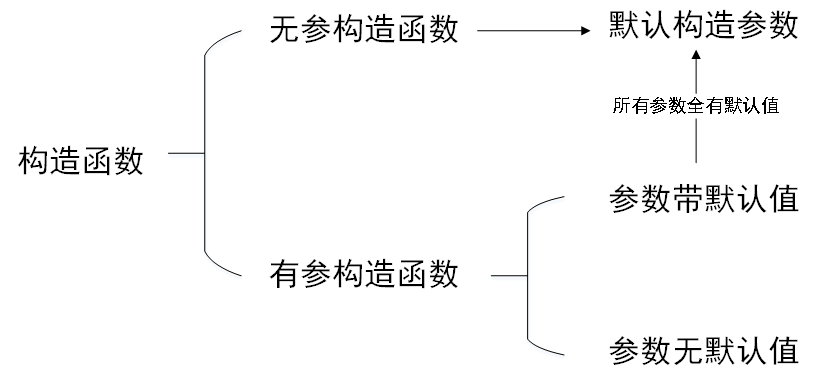
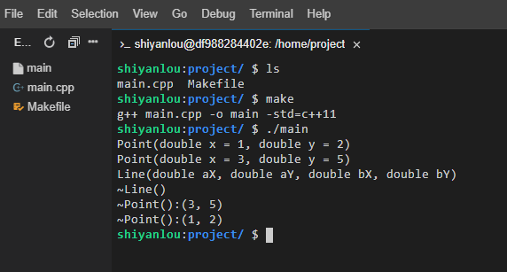
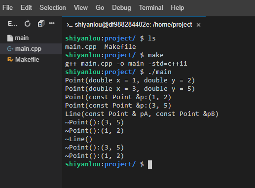
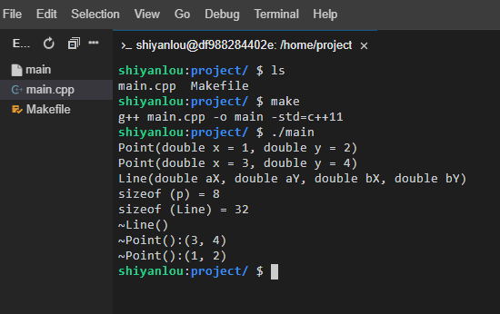

# C++ 相关概念

| 概念         | 描述                                                         |
| ------------ | ------------------------------------------------------------ |
| 构造函数     | 类的构造函数是一种特殊的函数，在创建一个新的对象时自动调用   |
| 析构函数     | 类的析构函数也是一种特殊的函数，在删除所创建的对象时自动调用 |
| 拷贝构造函数 | 拷贝构造函数，是一种特殊的构造函数，它在创建对象时，是使用同一类中之前创建的对象来初始化新创建的对象 |
| 友元函数     | 友元函数可以访问类的 private 和 protected 成员               |
| 内联函数     | 通过内联函数，编译器试图在调用函数的地方扩展函数体中的代码   |
| 类成员函数   | 类的成员函数是指那些把定义和原型写在类定义内部的函数，就像类定义中的其他变量一样 |
| 类访问修饰符 | 类成员可以被定义为 public、private 或 protected。默认情况下是定义为 private |
| this 指针    | 每个对象都有一个特殊的指针 this，它指向对象本身              |
| 静态成员     | 类的数据成员和成员函数都可以被声明为静态的                   |

# 01——初识类与对象

- ## 自定义类（01_类与对象/Student.cpp）

类定义注意事项：

1. 定义一个类时，需要使用关键字 class 来进行修饰。
2. 一个简单的类可以没有构造函数和析构函数，但是系统自动生成一个默认的构造函数和析构函数。
3. 在类中使用关键字 public 、 private 和 protected 来限制数据成员和成员函数，一般使用 public 和 private 来修饰数据成员和成员函数。
4. 一般将数据成员封装在 private 关键字下，不让用户直接访问数据成员，而是通过成员函数来进行访问。
5. 在类的最后（大括号后）必须要有一个分号，勿忘。

- ## 实例化对象（01_类与对象/main01.cpp）

**实例化对象有两种方式，一种是在栈上实例化，另一种是在堆上实例化。**

实例化对象注意事项：

1. 在栈上实例化的对象，超出定义域对象资源会自动被系统回收。
2. 在堆上实例化的对象，最后需要使用 delete 关键字来释放内存，否则会造成内存泄漏。
3. 使用栈实例化的对象使用 “.” 来访问数据成员或成员函数，在堆上实例化的对象使用 “->” 来访问数据成员或成员函数。
4. 释放完内存后将对象置空，防止野指针。

- ## String

#### string 初始化方式

| 实例化                          | 解释                            |
| ------------------------------- | ------------------------------- |
| string s1;                      | s1 为空字符串                   |
| string s2("ABC");               | s2 初始值为 "ABC"               |
| string s3 = s2;  string s3(s2); | s3 初始化为 s2 的一个副本       |
| string s4(n, 'c' );             | s4 初始化为字符 'c' 的 n 个副本 |

#### string 常用操作

> 以下列出了 string 经常使用的操作，如果还需要用到其他操作可以在 [官网](https://en.cppreference.com/w/) 查找 string 类的相关使用方法，里面配有示例程序。

| 操作      | 解释                                                  |
| --------- | ----------------------------------------------------- |
| s.empty() | 判断 s 是否为空，如果 s 为空返回 true，否则返回 false |
| s.size()  | 返回 s 中字符的个数，和 s.length() 功能相同           |
| s[n]      | 返回 s 中位置 n 的字符，位置从 0 开始。切记不要越界   |
| s1 + s2   | 将 s1 和 s2 连接成新字符串，返回新字符串              |
| s1 = s2   | 赋值，将 s2 内容赋值给 s1                             |
| s1 == s2  | 判断相等，相等返回 true，否则返回 false               |
| s1 != s2  | 判断不等，不等返回 true，否则返回 false               |
| s.c_str() | 返回 char*，和 s.data() 功能相同                      |
| stoi()    | 字符串转 int，还有 stol()，stoll()                    |
| stof()    | 字符串转 float, 还有 stod()，stold()                  |

- ## 类外定义（01_类与对象/main.cpp、Student.cpp、Student.h）

类外定义有两种方式：

1. 同文件类外定义。
2. 分文件类外定义。

同文件类外定义就是将类的成员函数定义在类之外的地方，同时类的成员函数使用类作用域来进行定义。在实际项目开发中，类不是很复杂时可以使用该方法，类比较复杂时不推荐使用。

分文件定义类就是将类的定义放在 `xxx.h` 头文件中，而类的成员函数实现放在 `xxx.cpp` 文件中。这种做法是做项目时推荐使用的方法，因为这样将类的定义和成员函数分开后，在开发时很容易能够查找到对应的定义和成员函数。

一般情况下文件名和类名相同，便于开发时类管理。

# 02——类的封装

> C++ 使用关键字 class 来进行封装，使用 public、protected、private 关键字表示封装的状态。

#### 关键字

- class：对类进行封装。
- public：共有成员，用户能够直接访问类中 public 属性的数据成员和成员函数。
- protected：保护成员，用户不能直接访问数据成员和成员函数，继承该类后可以访问。
- private：私有成员，用户不能直接访问数据成员和成员函数。

#### 代码解释（02_类与封装/Student.cpp、Point.cpp、Cat.cpp）

- 示例代码 1 中，学生类 private 以下区域的数据成员 name 和 age 都属于私有数据成员，public 下的成员函数都是属于公有属性。
- 默认情况下，类的成员都是私有属性，例如示例代码 2 中 Point 类的数据成员 x 和 y 都是属于私有属性。
- struct 和 class 是类似的功能，但是 struct 默认情况下成员都是公有属性，如示例代码 3，struct 一般用于定义数据结构。
- 数据成员与成员函数绑定，不能直接对私有数据成员进行访问，如果需要访问数据成员则需要访问对应绑定的公有成员函数。

# 03——对象的生离死别

- ## 内存分区

#### 介绍

> 根据存储数据的类型，系统将不同类型的数据存储在不同的区域，作为 C++ 开发者，必须对内存的分区以及使用了然于心。

#### 分区

一般情况下，根据内存用途将内存划分为五个区：

| 内存区 | 用途解释                   |
| ------ | -------------------------- |
| 栈区   | 存储函数的参数、局部变量等 |
| 堆区   | 由程序员分配、释放内存     |
| 全局区 | 存储全局变量和静态变量     |
| 常量区 | 存储常量                   |
| 代码区 | 存储逻辑代码的二进制       |

#### 栈与堆对比

| 功能                 | 栈                                          | 堆                                                           |
| -------------------- | ------------------------------------------- | ------------------------------------------------------------ |
| 申请与释放           | 编译器自动分配、回收                        | 程序员分配和释放（C 使用 malloc 申请内存、free 释放内存；C++ 使用 new 申请内存、delete 释放内存） |
| 申请内存后系统的响应 | 申请空间大于栈空间时程序将提示异常 (栈溢出) | 超过内存空间程序报异常                                       |
| 空间大小限制         | window 1 M linux 8 M                        | 系统内存，比栈大很多                                         |
| 申请效率             | 快                                          | 比较慢                                                       |

#### 代码解释（03_对象的生离死别/Plan.cpp）

- 编译时 getWingCount 只存储一份。
- 实例化的对象 p1、p2、p3 存储在栈上。
- 当对象调用 getWingCount 成员函数只需要找到相应地址即可。
- 当变量没有被初始化时是一个随机值，建议所有变量都初始化。
- 示例代码 1 中数据在类默认私有属性区域，但一般建议添加封装属性关键字。

- ## 构造函数

> 定义：构造函数又称构造方法、建构子、构造器，是类里用于创建对象的特殊子程序。可以初始化一个新建的对象，并时常接受参数用以设定实例变量。

#### 规则与特点

- 对象实例化时自动被调用。
- 与类名同名。
- 没有返回值。
- 可以有多个重载形式。
- 实例化对象时仅用到一个构造函数。
- 当用户没有定义构造函数时，编译器自动生成。

- ## 拷贝构造函数（03_对象的生离死别/Teacher.cpp）

- 语法格式：`类名(const 类名 &变量)`。
- 如果没有自定义构造函数，系统自动生成。
- 采用直接初始化或赋值初始化实例化对象时系统自动调用拷贝构造函数。

注意：

- 拷贝构造函数也是构造函数的一种，当执行了拷贝构造函数后就不会执行其他构造函数。
- 如果不涉及深拷贝，可以不实现拷贝默认构造函数，使用系统自动生成的拷贝构造函数即可。

- ## 初始化列表（03_对象的生离死别/Circle.cpp）

- 先于构造函数执行。

- 只能用于构造函数。

- 可以同时初始化多个数据成员，多个数据成员之间使用逗号隔开。

  #### 注意：

- 语法格式：`类名() : 数据成员 1(参数), 数据成员 2(参数) {}`。
- 由于初始化列表先于构造函数执行，当类中有 const 常量时就必须要用到初始化列表来初始化。
- 推荐使用初始化列表的方式来初始化数据成员。
- 如果类中有数据成员时，推荐将数据成员都初始化。

# 04——对象与对象数组

> 假设定义了一个学生类，现在要实例化一个班的学生，如果逐个对学生进行实例化操作那肯定是非常麻烦的，这时使用对象数组就能很方便的完成编写。假设有一个点类，如果实例化一个矩形也可以使用对象数组的方式。

- ## 对象成员

#### 示例代码 （04_对象与对象数组/Line01.cpp）

首先看一下当对象 A 有对象 B 时调用构造函数与析构函数的顺序。

运行结果：可以看到先调用 pointA 的构造函数，再调用 pointB 的构造函数，最后调用 Line 的构造函数；而析构函数时正好反过来的。这也是为什么当对象成员没有默认构造函数时必须要使用初始化列表的原因，因为对象成员先于对象初始化。

#### 示例代码 （04_对象与对象数组/Line02.cpp）

> 如果将对象成员类型作为参数输入时看看其调用构造函数以及析构函数的顺序。

运行结果：对象成员类型作为参数传入时，传入的参数时会临时创建两个对象，初始化完成后临时对象自动销毁。

#### 示例代码 （04_对象与对象数组/Line03.cpp）

运行结果：p 指针占 4 字节，Line 类中有两个 Point 类数据成员，Point 类有两个 double 类型数据成员，所以 Line 一共占 32 个字节。

# 05——深拷贝与浅拷贝

什么时候会发生深拷贝或者浅拷贝？

答：调用拷贝构造函数时。

- 浅拷贝：将对象 A 中数据成员赋值给对象 B 中数据成员。
- 深拷贝：对象 B 先为数据成员申请对象 A 中数据成员同样大的内存，再将对象 A 中数据成员赋值给对象 B 中数据成员。

